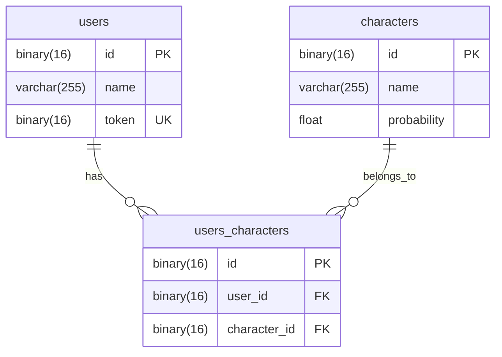
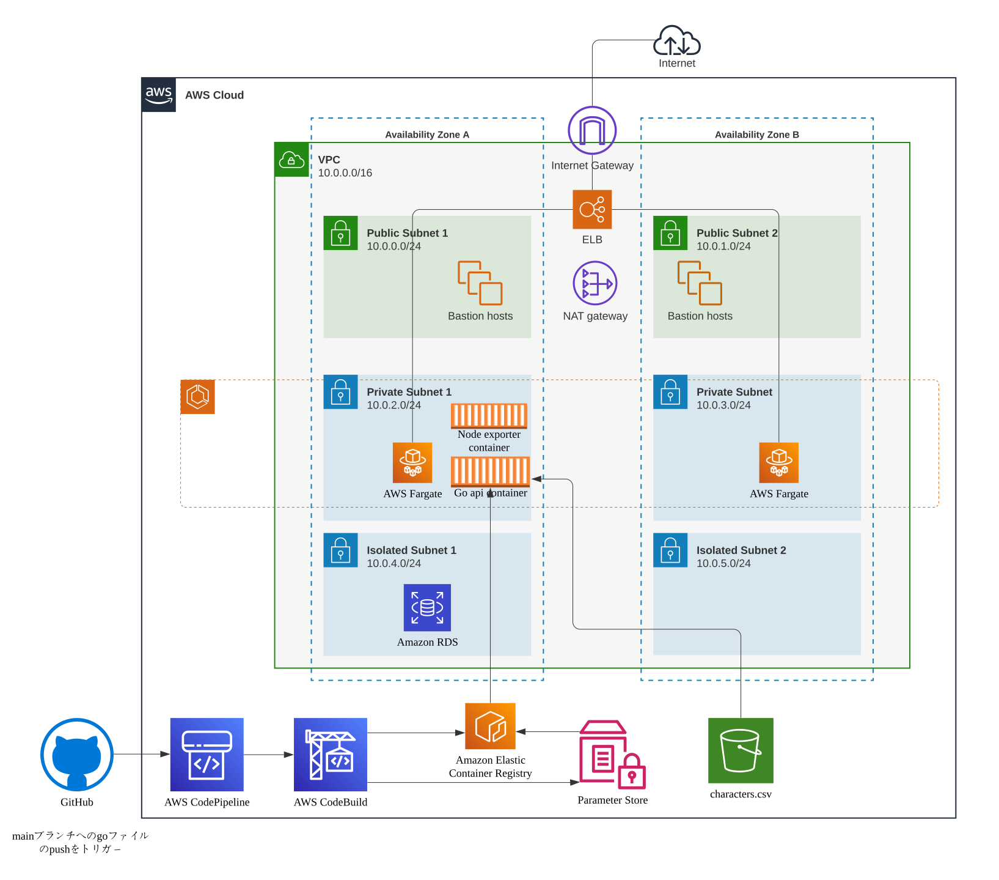
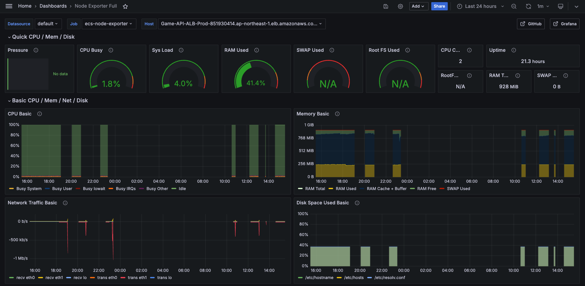

# ゲームガチャAPIの実装

## 概要
TechTrain MISSION　[オンライン版　CA Tech Dojo サーバサイド (Go)編](https://github.com/CyberAgentHack/techtrain-mission) のリポジトリ。 
スマートフォン向けゲームのAPIの開発。 
API仕様YAML: https://github.com/ShinnosukeSuzuki/techtrain-mission-ca-tech-dojo-golang/blob/main/api-document.yaml 
作成したAPIは以下の6つ。 
認証はリクエストヘッダのx-tokenを読み取ってデータベースに照会する。
| エンドポイント | メソッド | 認証 | 説明 |
|----------------|----------|------|------|
| /user/create | POST | - | ユーザアカウント認証情報作成API |
| /user/get | GET | 必要 | ユーザ情報取得API |
| /user/update | PUT | 必要 | ユーザ情報更新API |
| /gacha/draw | POST | 必要 | ガチャ実行API |
| /character/list | GET | 必要 | ユーザ所持キャラクター一覧取得API |
| /health-check | GET | - | ALB target groupのヘルスチェック用API |

## DB設計
DB設計は下図のようにした。それぞれのテーブルのIDはUUID(v4)を使用した。 
MySQLではUUIDをvacharで保存するとパフォーマンスが悪くなることからバージョン8から使用できるUUID_TO_BINなどを使用してbinaryで保存するようにした。 
ガチャから排出されるキャラクターの数は**11472**体。データは[パズドラモンスターデータベース](https://padmdb.rainbowsite.net/about)からレア度が1以外のもの取得し、確率はレア度の逆数とした。

## インフラ構成図
下図の様にAWS ECS on Fargateを使ってデプロイした。 
[インフラ構成の詳細](https://github.com/ShinnosukeSuzuki/techtrain-mission-ca-tech-dojo-golang/blob/main/infra/game-api-infrastructure/README.md)

## CICD
CICDにはAWS CodePipelineとCodeBuildを使用した。 
mainブランチへのpushをトリガーとし、mdファイルやinfraディレクトリの変更はトリガーから除いた。 
具体的には以下を実行する
1. go api のDockerfileのbuild
2. ECRへのpush
3. パラメータストアで保存しているECSがpullするECRのtag値を更新
4. cdk deployを行い、ECSのローリングアップデート(CodeDeployを使用してblue/greenデプロイするように改修予定)
## メトリクス監視
go api サーバーのサイドカーに[Node exporter](https://github.com/prometheus/node_exporter)を置くことでtaskのメトリクスを取得し、ローカルのPrometheusで収集、Grafanaで可視化した。 
 

## 工夫した点
ガチャで排出するキャラクター情報をS3から取得し、ガチャのロジックで必要となる各キャラクターの累積確率などをキャッシュ化することでリクエストごとにDBからキャラクターを取得する必要がなくなり、より多くのリクエストを捌けるようにした。具体的な数値としてはECS on Fargate(1vCPU)で**110RPS**(キャッシュ導入前は30RPS)だった。 
[キャッシュ導入前後のガチャ実行APIにおける負荷テストの詳細](https://github.com/ShinnosukeSuzuki/techtrain-mission-ca-tech-dojo-golang/blob/main/infra/performance-test/README.md)

## 使用技術
Go(1.22.4), Echo(4.12.0), MySQL(8.0), AWS ECS, AWS RDS, AWS CodePipleline, AWS CodeBuild, AWS Lambda, AWS S3, AWS CDK, Prometheus, Grafana, Locust
