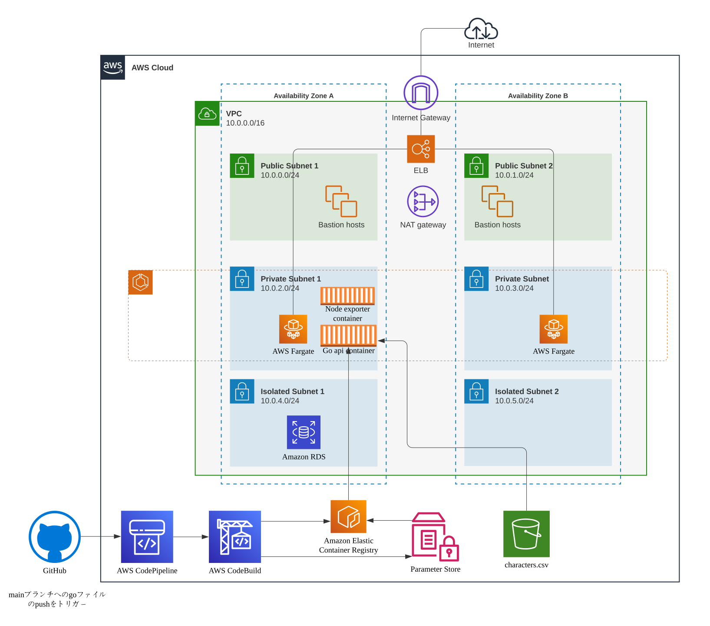

# GAME API インフラ
## 構成図



## 各リソースの詳細
- network-resources
    - VPC
        - public subnet : ALBを配置
        - private subnet : ECS task, 踏み台サーバーを配置
        - isolated subnet : RDSを配置
        - s3VpcEndpoint : S3用のGatewayVpcEndpoint
    - SecurityGroup
        - ALB SecurityGroup : port 80で全てのIPからのみ許可
        - ECS SecurityGroup : port 8080でALB SecurityGroupのみ許可
        - RDS SecurityGroup : port 3306でECS, BastionのSecurityGroupのみ許可
        - Bastion SecurityGroup : 許可なし(ssmを使用するためport 22は開けない)
- database-resources
    - RDS(t3.micro)
- character-bucket-{$env} : マスターデータであるcharactersテーブルの情報を保存するバケット
    - characters.csv : マスターデータであるcharactersテーブルの情報(データは[パズドラモンスターデータベース](https://padmdb.rainbowsite.net/about)からレア度が1以外のもの取得し、charactersの確率はレア度の逆数とした。)
- lambda-by-s3-resources
    - lambda-layer : lambdaを実行するのに必要なライブラリを保存。作成方法は[記事](https://qiita.com/kt215prg/items/d934c92226524a88714f)を参考にdocker上で行った。
    - lambda(python3.9) : s3にアップロードされたcharacters.csvを元にcharactersテーブルの情報を更新する。
    - rule : S3バケット(character-bucket-{$env})へのアップロードをトリガーにlambdaを起動。
- bastion-resources
    - 踏み台サーバー(t2.micro) : ssmでポートフォワードしRDSに接続するため。
- alb-resources
    - http listnerを作成
- ECR : 本リポジトリのgoのdockerfileを管理。管理できるimage数は5つ。
- ecs-fargate-resources
    - ECS cluster : containerInsightsを許可(負荷試験時にGrafanaでCPU使用率などを可視化するため)。
    - Service : port 8080でリッスンするターゲットグループを作成し、ALBのデフォルトアクションとした。
    - task : スペックはCPUが0.25vCPUでメモリを0.5GBとした。コンテナimageはssm(`/ECR/game-api-{$env}/tag`)から取得。
- cicd-resources
    - codepipeline : 当リポジトリのmain(envがDevの場合はdevelop)へのpushをトリガーとした。ただしinfaディレクトリの変更ではトリガーしない。
    - codebuild : 
        1. go apiのdockerfile build
        2. ECRへのpush
        3. ssm(`/ECR/game-api-{$env}/tag`)を`CODEBUILD_RESOLVED_SOURCE_VERSION`から7文字を取得し値を更新
        4. cdk deployしECS taskの更新

## Useful commands
以下のコマンドを実行することでデプロイできる
```
export ENV=環境名 # (本番：Prod、開発：Dev)
cdk deploy
```
