# Locustを用いたAPIの負荷テスト
## 目次
- [概要](#概要)
- [インフラのスペック](#インフラのスペック)
- [テスト方法](#テスト方法)
- [キャッシュ導入前](#キャッシュ導入前)
  - [Users = 50](#users-50-before)
  - [Users = 35](#users-35-before)
  - [まとめ](#まとめ-before)
- [キャッシュ導入後](#キャッシュ導入後)
  - [Users = 50](#users-50-after)
  - [Users = 100](#users-100-after)
  - [Users = 150](#users-150-after)
  - [Users = 125](#users-125-after)
  - [Users = 110](#users-110-after)
  - [まとめ](#まとめ-after)
- [各テーブルの主キーをUUIDv7(BINARY)に変更](#各テーブルの主キーをuuidv7binaryに変更)
  - [Users = 125](#users-125-uuidv7)
  - [Users = 150](#users-150-uuidv7)
  - [まとめ](#まとめ-uuidv7)

## 概要
ガチャ実行APIの`/gacha/draw`に対してLocsutを用いて、負荷テストを行い、RPSを算出する。</br>
実務レベルのゲーム開発におけるバックエンドではキャラクターなどのユーザーが変えることのできないマスターデータはDBから直接参照せず、キャッシュさせることで高速化させていると[勉強会](https://cyberagent.connpass.com/event/328082/)でお聞きした。</br>
この負荷テストではキャッシュの導入前後でRPSやDBへの負荷の変化を検証する。
## インフラのスペック
ECS on Fargate : 1vCPU</br>
RDS インスタンスクラス : db.t3.medium</br>

## テスト方法
負荷テストを行うAPIはガチャ実行APIの`/gacha/draw`。</br>
Locustで`wait_time = constant_throughput(1)`とすることで各リクエストが1000msを切る場合はUsers=RPSとなることから、最大のRPSを探索した。</br>
テスト時間は5分とした。</br>
負荷テスト中のCPU使用率やメモリ使用率をnode_exporterから取得し、Grafanaで可視化した。</br>
DBのどのクエリの負荷が高いかをPerformance Insightsを使用して可視化した。</br>
各ユーザーのリクエストのx-tokenは同一のものを使用した。</br>


## キャッシュ導入前

<h3 id="users-50-before">Users = 50</h3>

**LocustによるRPSとレスポンスタイム、ユーザー数の図**
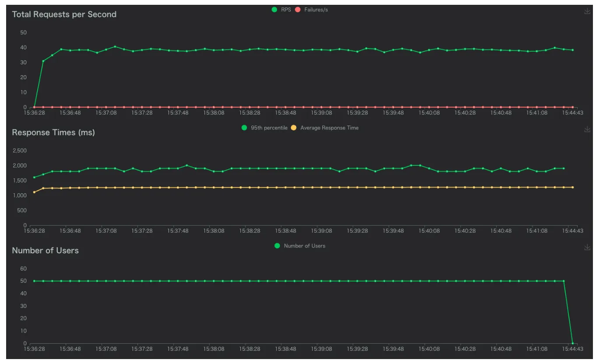</br>

**CPU使用率とメモリ使用率**
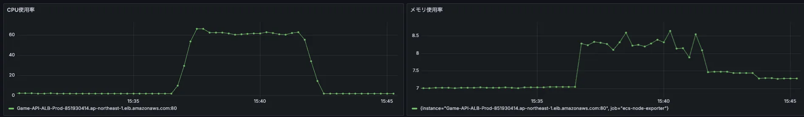</br>

**Performance Insightsによるクエリの負荷の可視化**
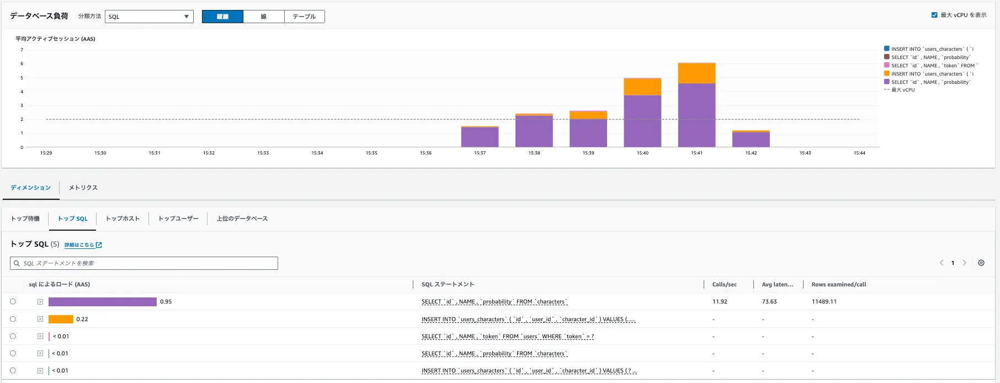</br>
<h3 id="users-35-before">Users = 35</h3>

**LocustによるRPSとレスポンスタイム、ユーザー数の図**
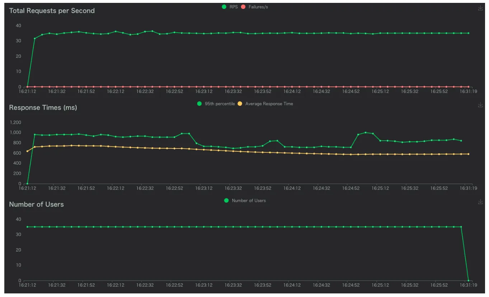</br>

**CPU使用率とメモリ使用率**
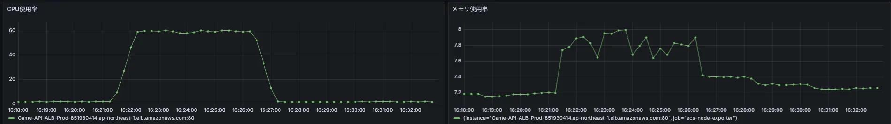</br>

**Performance Insightsによるクエリの負荷の可視化**
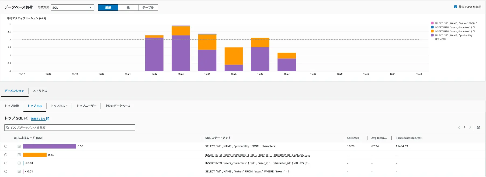</br>

<h3 id="まとめ-before">まとめ</h3>

上記の結果よりRPSは35であることがわかった。</br>
CPU使用率が100％近くまで上昇していないことからDBでの処理周りがボトルネックになっている可能性が高いことがわかった。</br>
DBへの負荷が高いクエリは以下であった。
```sql
SELECT `id` , NAME , `probability` FROM `characters`
```
これよりキャラクターを全件取得し、累積確率を計算している部分が問題であることがわかった。この部分についてはキャッシュを導入することで上記クエリを実行しなくなるため大幅な改善が見込まれる。
## キャッシュ導入後

<h3 id="users-50-after">Users = 50</h3>

**LocustによるRPSとレスポンスタイム、ユーザー数の図**
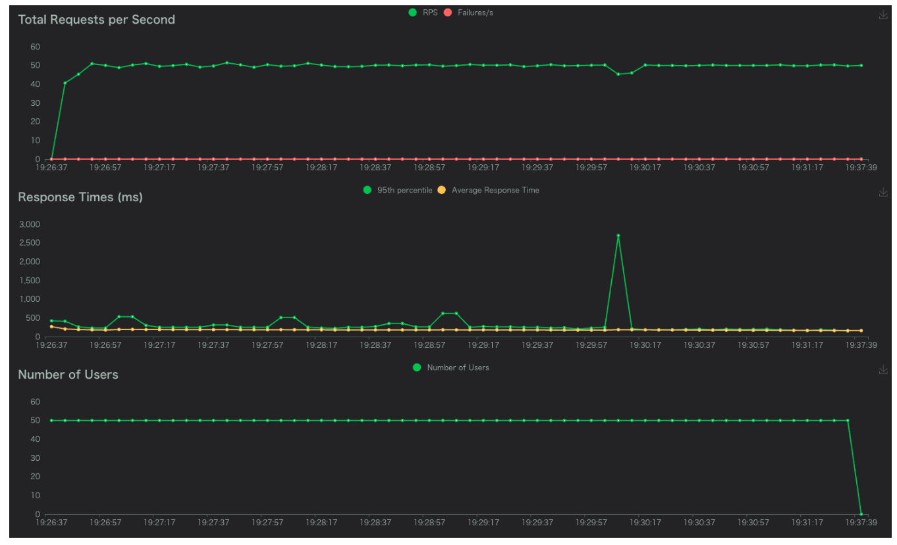</br>

**CPU使用率とメモリ使用率**
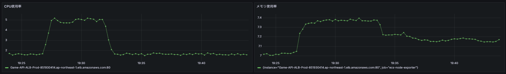</br>

**Performance Insightsによるクエリの負荷の可視化**
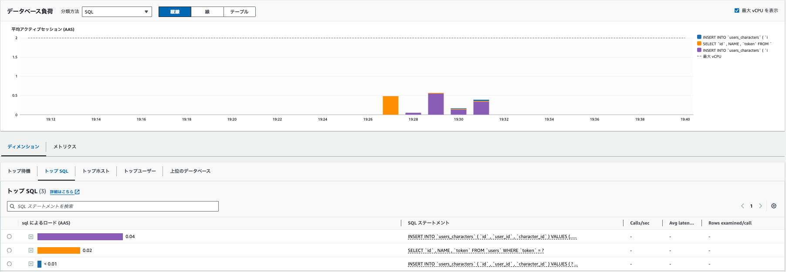</br>

<h3 id="users-100-after">Users = 100</h3>

**LocustによるRPSとレスポンスタイム、ユーザー数の図**
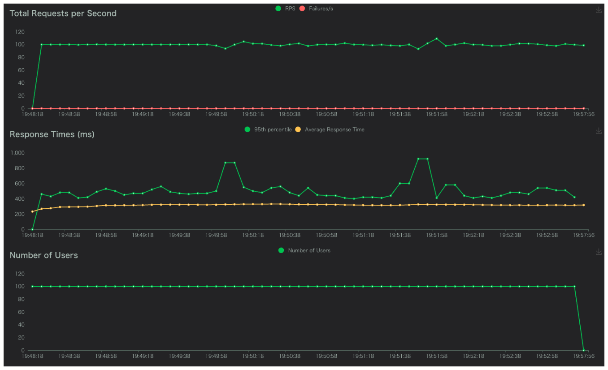</br>

**CPU使用率とメモリ使用率**
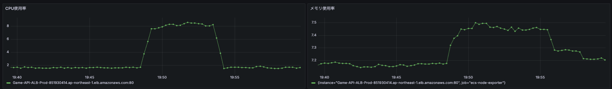</br>

**Performance Insightsによるクエリの負荷の可視化**
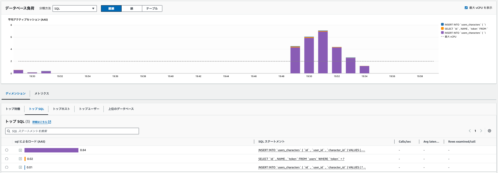</br>

<h3 id="users-150-after">Users = 150</h3>

**LocustによるRPSとレスポンスタイム、ユーザー数の図**
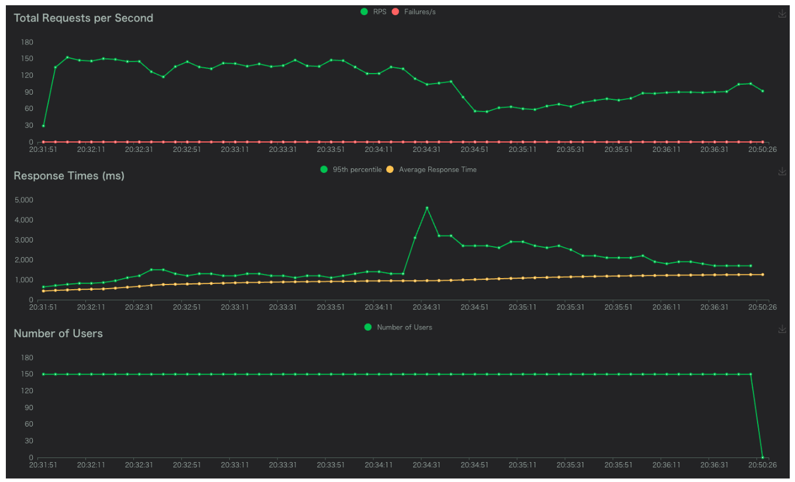</br>

**CPU使用率とメモリ使用率**
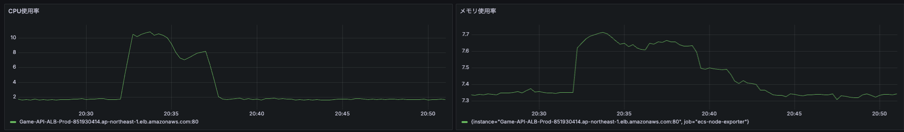</br>

**Performance Insightsによるクエリの負荷の可視化**
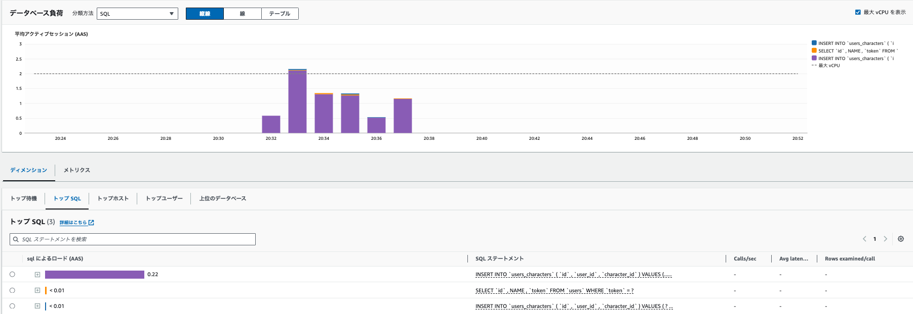</br>

<h3 id="users-125-after">Users = 125</h3>

**LocustによるRPSとレスポンスタイム、ユーザー数の図**
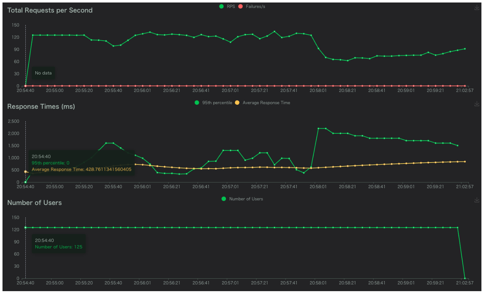</br>

**CPU使用率とメモリ使用率**
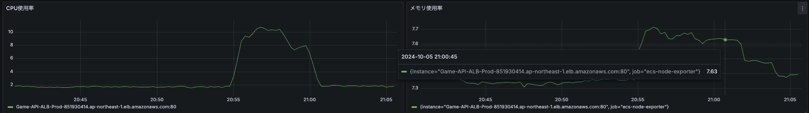</br>

**Performance Insightsによるクエリの負荷の可視化**
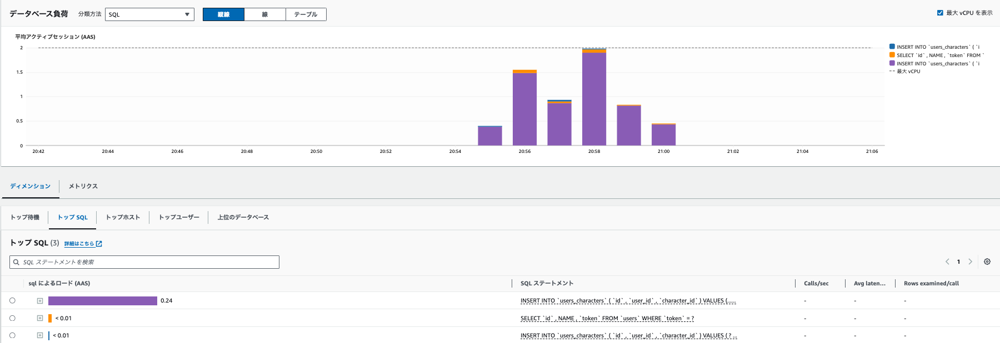</br>

<h3 id="users-110-after">Users = 110</h3>

**LocustによるRPSとレスポンスタイム、ユーザー数の図**
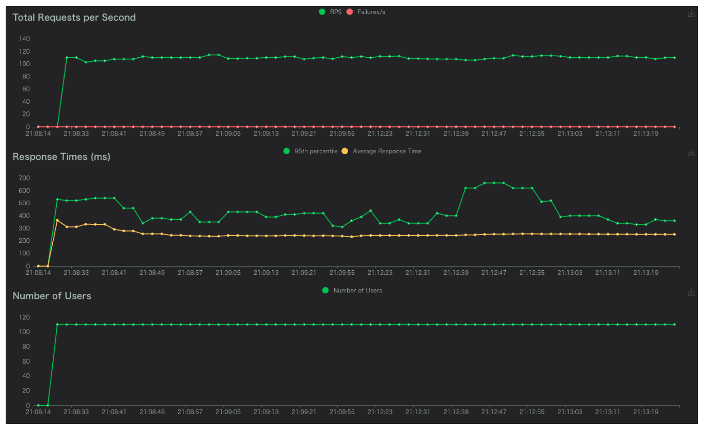</br>

**CPU使用率とメモリ使用率**
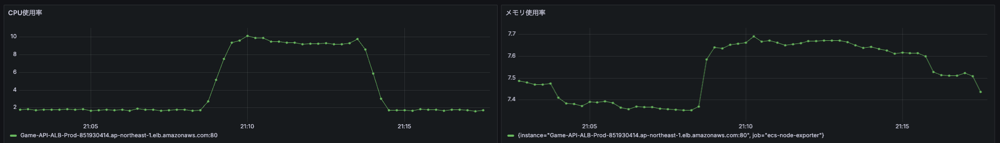</br>

**Performance Insightsによるクエリの負荷の可視化**
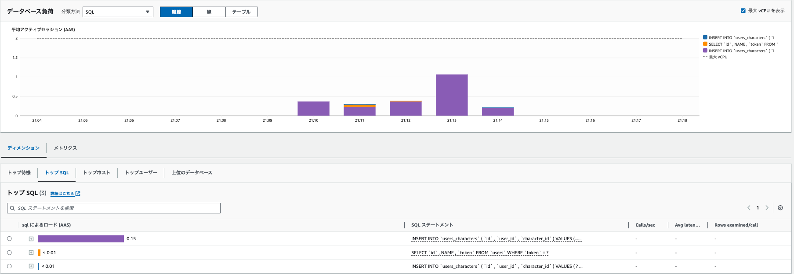</br>

<h3 id="まとめ-after">まとめ</h3>

上記の結果よりRPSは110であることがわかった。</br>
キャッシュ導入以前はcharactersテーブルからのデータ取得の負荷が高かったが、キャッシュを導入したことでこのクエリの実行はなくなりDBの負荷が下がったことがRPS向上の要因として考えられる。</br>
ただ、ガチャ結果のインサート処理の負荷が高くなっていたので、インサートするデータをキャッシュサーバーに送り、キャッシュサーバーから定期的にDBへバルクインサートする仕組みを作ることでさらにRPSが改善する可能性がある。</br>
また上記の負荷試験では各テーブルの主キーをUUID v4(VARCHAR)としていたため、インサート処理の負荷が高くなった可能性があるので、IDカラムをBINARY、UUIDを完全ランダムなv4から順序があるv7に変更することでDBへの負荷が下がり、RPSが向上すると考えられる。

## 各テーブルの主キーをUUIDv7(BINARY)に変更
UUIDv4ではインサート処理が遅くなることからUUIDv7に変更し、BINARY型で保存するように変更した場合の負荷テストを実施した。

<h3 id="users-125-uuidv7">Users = 125</h3>

**LocustによるRPSとレスポンスタイム、ユーザー数の図**
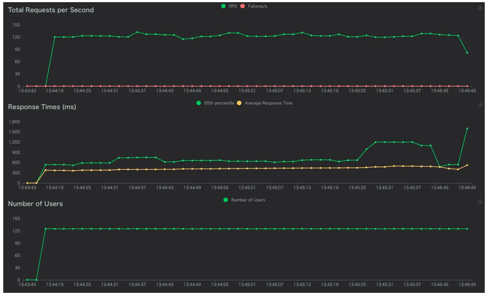</br>

**CPU使用率とメモリ使用率**
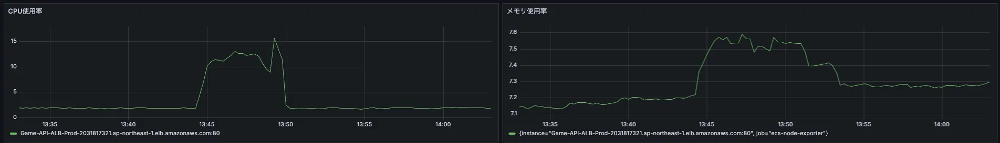</br>

**Performance Insightsによるクエリの負荷の可視化**
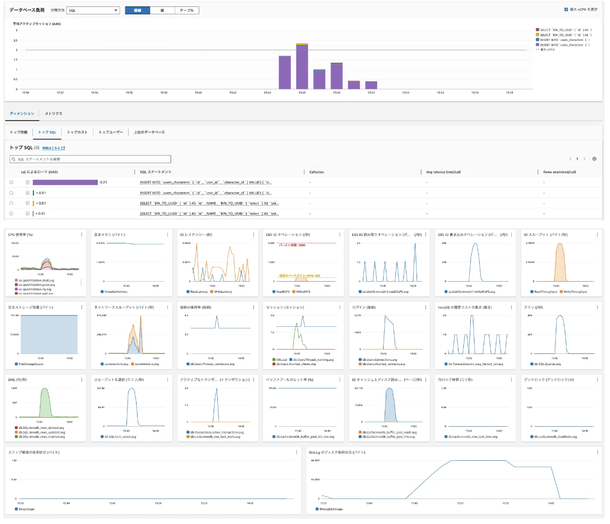</br>

<h3 id="users-150-uuidv7">Users = 150</h3>

**LocustによるRPSとレスポンスタイム、ユーザー数の図**
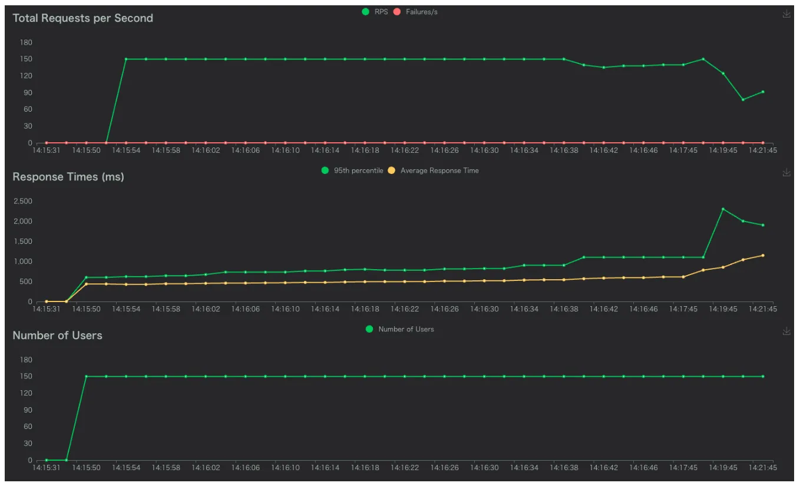</br>

**CPU使用率とメモリ使用率**
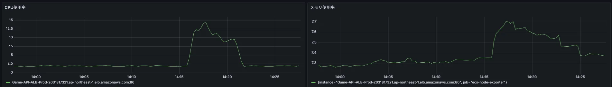</br>

**Performance Insightsによるクエリの負荷の可視化**
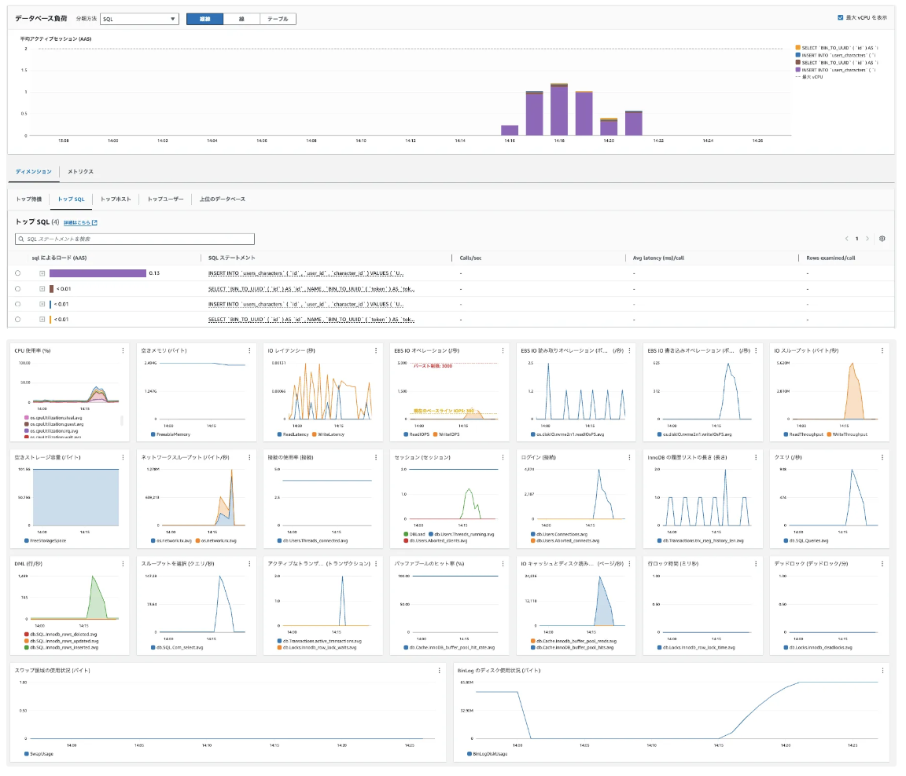</br>

<h3 id="まとめ-uuidv7">まとめ</h3>

これらの結果より、Users=125, 150で明らかに変更前よりRPSが急激に落ちることはなく安定していた。ただ、それでも劇的な改善とまではいかないため、直接DBにインサートしているのを止める仕組みを導入しないとRPSの向上は見れないと考える。
