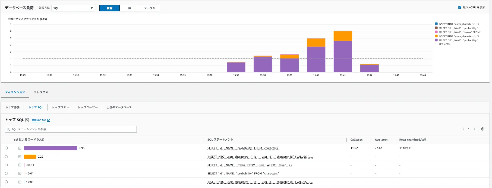
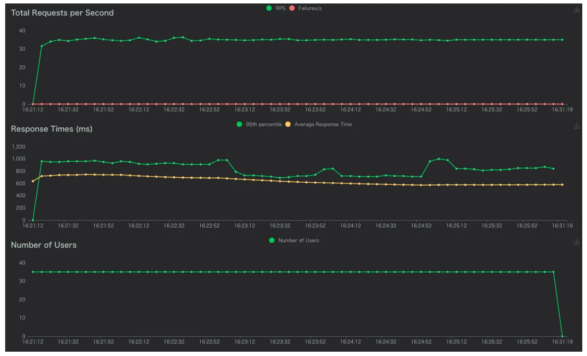
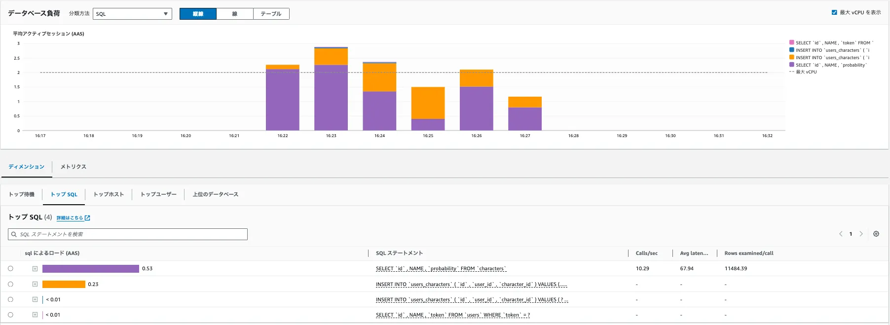

# Locustを用いたAPIの負荷テスト
## 概要
ガチャ実行APIの`/gacha/draw`に対してLocsutを用いて、負荷テストを行い、RPSを算出する。</br>
実務レベルのゲーム開発におけるバックエンドではキャラクターなどのユーザーが変えることのできないマスターデータはDBから直接参照せず、キャッシュさせることで高速化させていると[勉強会](https://cyberagent.connpass.com/event/328082/)でお聞きした。</br>
この負荷テストではキャッシュの導入前後でRPSやDBへの負荷の変化を検証する。
## インフラのスペック
ECS on Fargate : 1vCPU</br>
RDS インスタンスクラス : db.t3.medium</br>

## テスト方法
負荷テストを行うAPIはガチャ実行APIの`/gacha/draw`。</br>
Locustで`wait_time = constant_throughput(1)`とすることで各リクエストが1000msを切る場合はUsers=RPSとなることから、最大のRPSを探索した。</br>
負荷テスト中のCPU使用率やメモリ使用率をnode_exporterから取得し、Grafanaで可視化した。</br>
DBのどのクエリの負荷が高いかをPerformance Insightsを使用して可視化した。</br>
各ユーザーのリクエストのx-tokenは同一のものを使用した。</br>


## キャッシュ導入前
### Users = 50
**LocustによるRPSとレスポンスタイム、ユーザー数の図**
</br>

**CPU使用率とメモリ使用率**
</br>

**Performance Insightsによるクエリの負荷の可視化**
</br>
### Users = 35
**LocustによるRPSとレスポンスタイム、ユーザー数の図**
</br>

**CPU使用率とメモリ使用率**
</br>

**Performance Insightsによるクエリの負荷の可視化**
</br>

### まとめ
上記の結果よりRPSは35であることがわかった。</br>
CPU使用率が100％近くまで上昇していないことからDBでの処理周りがボトルネックになっている可能性が高いことがわかった。</br>
DBへの負荷が高いクエリは以下であった。
```sql
SELECT `id` , NAME , `probability` FROM `characters`
```
これよりキャラクターを全件取得し、累積確率を計算している部分が問題であることがわかった。この部分についてはキャッシュを導入することで上記クエリを実行しなくなるため大幅な改善が見込まれる。
## キャッシュ導入後
todo
